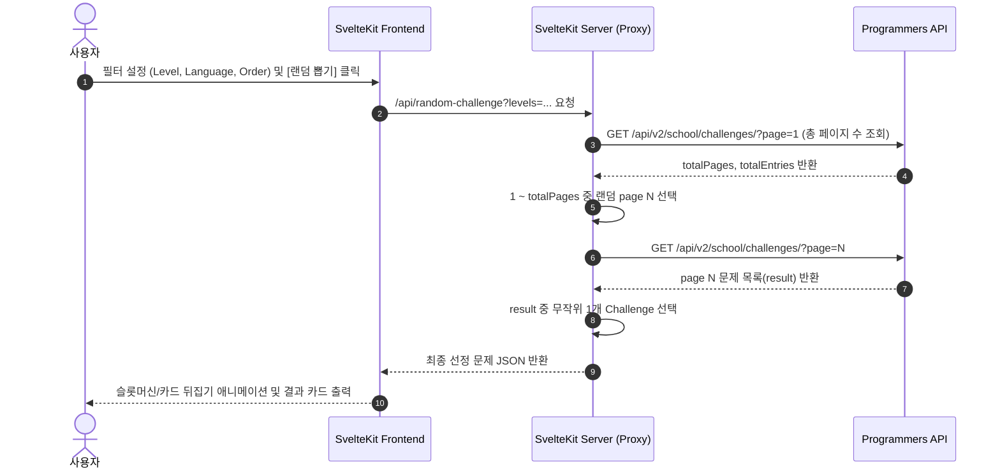

# ProPick (프로픽) 요구사항 정의서 (SRS)

## 1. 프로젝트 개요 (Overview)

* **프로젝트명**: ProPick (프로픽 - 프로그래머스 랜덤 문제 추천 서비스)
* **목적**: 프로그래머스(Programmers) 코딩 테스트 문제 중 사용자 맞춤형 필터 조건(난이도, 언어, 정렬 기준 등)에 따라 무작위(Random)로 문제를 추첨 및 추천해 주는 웹 애플리케이션
* **핵심 가치**:
  * **우유부단함 해소**: 조건에 맞는 문제를 즉시 무작위 추첨하여 학습 효율 증대
  * **뛰어난 UI/UX**: 감각적이고 직관적인 디자인과 몰입감 있는 추첨 인터랙션 제공
  * **유지보수성 & 신뢰성**: 클린 코드, 높은 확장성, 비즈니스 로직의 테스트 코드 검증

---

## 2. 개발 환경 및 기술 스택 (Tech Stack & Environment)

### 2.1 개발 환경 (Dev Environment)
* **OS**: Windows 11
* **Shell**: PowerShell
* **IDE**: Visual Studio Code

### 2.2 기술 스택 (Project Stack)
* **Framework**: [SvelteKit](https://kit.svelte.dev/) (latest)
* **Styling**: [Tailwind CSS](https://tailwindcss.com/) (latest) + Custom CSS Design System
* **Language**: TypeScript / JavaScript
* **Testing**: Vitest (비즈니스 로직 단위 테스트 및 검증)

---

## 3. 디자인 시스템 및 UI/UX 가이드라인 (Design & UX)

`docs/DESIGN.md` 및 modern web aesthetics 기준 준수

### 3.1 Color Palette
* **Dominant Color (주 색상)**: `#F5D0C5` (Soft Pale Pink / Cream)
* **Secondary Colors (보조 색상)**: 
  * `#D69F7E` (Warm Sand Brown)
  * `#774936` (Deep Wood Brown)
* **Accent Color (포인트/텍스트)**: `#050609` (Deep Off-Black)

### 3.2 UI/UX 디자인 원칙
* **모던 & 엘레강트 aesthetics**: Glassmorphism, 부드러운 그래디언트, 깔끔한 카체 형태의 카드 UI.
* **다이내믹 모션 인터랙션**:
  * 문제 추첨 시 슬롯머신 / 카드 뒤집기 / 무작위 카운트다운 모션 연출로 몰입감 극대화
  * 버튼 호버, 선택 필터 토글 시 미세 인터랙션(Micro-animations) 적용
* **반응형 웹 지원**: 모바일, 태블릿, 데스크톱 환경 모두에 최적화된 레이아웃

---

## 4. 기능 요구사항 (Functional Requirements)

### 4.1 필터 설정 (Filter Configuration)
* **난이도 필터 (`levels[]`)**:
  * Level 0 ~ Level 5 다중 선택 지원 (선택 해제 시 전체 대상)
* **언어 필터 (`languages[]`)**:
  * C, C++, Java, JavaScript, Python3 등 주요 언어 선택 지원
* **초기화 기능**: 설정한 모든 필터를 기본값으로 리셋

### 4.2 랜덤 추첨 엔진 (Randomizer Engine)
* **공평한 무작위 추출 알고리즘**:
  1. 사용자 선택 필터 기반 1페이지 API 요청으로 총 페이지 수(`totalPages`) 및 총 문제 수(`totalEntries`) 파악
  2. `1 ~ totalPages` 사이의 난수(Random Page) 선택
  3. 해당 페이지의 `result` 목록(최대 perPage 개) 중 난수로 1개 문제 최종 선정
* **CORS Proxy / SvelteKit Server Route**:
  * 브라우저에서 프로그래머스 API 직접 호출 시 발생할 수 있는 CORS 제약을 해결하기 위해 SvelteKit Server Endpoint (`+server.ts` 또는 Server Load Function)를 통한 프록시 통신 제공

### 4.3 결과 표시 및 인터랙션 (Result & Interaction)
* **문제 카운트다운/추첨 카드**:
  * 문제 ID, 제목 (`title`), 카테고리/파트 (`partTitle`), 난이도 (`level`), 정답률 (`acceptanceRate`), 완료자 수 (`finishedCount`) 표시
  * 난이도별 시각적 배지(Color Badge) 표시
* **직접 이동 링크**:
  * 선택된 문제의 프로그래머스 링크 (`https://school.programmers.co.kr/learn/courses/30/lessons/{id}`) 새 탭으로 열기 버튼 제공
* **다시 뽑기 (Reshuffle)**:
  * 필터 조건을 유지한 채 새로운 무작위 문제 재추첨 기능
* **히스토리 / 즐겨찾기**:
  * 최근 추첨된 문제 목록을 `LocalStorage`에 저장하여 다시 보기 및 즐겨찾기 등록 기능 제공

---

## 5. 비기능 요구사항 (Non-Functional Requirements)

### 5.1 테스트 및 품질 보증 (Testing & Quality)
* **비즈니스 로직 테스트 100% 검증**:
  * API 쿼리 스트링 빌더 (`buildApiUrl`)
  * 랜덤 페이지 및 인덱스 계산 알고리즘 (`getRandomChallengeIndex`)
  * 필터링 상태 관리 로직
  * 단위 테스트 framework: **Vitest**

### 5.2 유지보수성 및 코드 가독성 (Maintainability & Readability)
* **단일 책임 원칙 (SRP)**: 비즈니스 로직(API 호출, 무작위 추출 연산)과 UI 컴포넌트(필터 폼, 결과 카드) 완전 분리
* **독립적 모듈 구조**: 향후 필터 조건 추가나 다른 코딩테스트 플랫폼 확장 시 쉽게 수정 가능하도록 설계

### 5.3 성능 및 예외 처리 (Performance & Robustness)
* **예외 처리**: API 네트워크 에러, 조건에 만족하는 문제가 0개일 경우 visual fallback 화면 노출
* **로딩 UX**: Skeleton UI 및 Spinner 연출로 사용자 대기 시간 지루함 최소화

---

## 6. 외부 API 명세 (External API Interface)

### 6.1 Programmers Challenges API
* **Endpoint**: `GET https://school.programmers.co.kr/api/v2/school/challenges/`
* **Query Parameters**:
  | Parameter | Type | Description |
  | --- | --- | --- |
  | `perPage` | integer | 페이지당 문제 수 (예: 20) |
  | `levels[]` | integer | 문제 난이도 (0~5) |
  | `languages[]` | string | 문제 언어 (`c`, `cpp`, `java`, `javascript`, `python3` 등) |
  | `order` | string | 정렬 기준 (`recent`, `acceptance_desc`, `acceptance_asc`) |
  | `page` | integer | 페이지 번호 (1부터 시작) |

* **Data Model (TypeScript Interface 예시)**:
```typescript
export interface Challenge {
  id: number;
  title: string;
  partTitle: string;
  level: number;
  finishedCount: number;
  acceptanceRate: number;
  status: string;
  openedAt: string;
  bookmarked: boolean;
}

export interface ChallengeApiResponse {
  page: number;
  perPage: number;
  totalPages: number;
  totalEntries: number;
  languages: string[];
  result: Challenge[];
}
```

---

## 7. 시스템 흐름도 (System Workflow)

